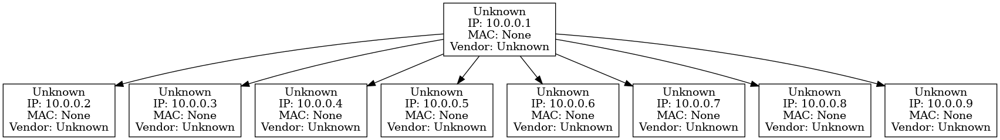

# Local Network Mapping & Documentation (Sanitized)

## Objective
Demonstrate local network discovery and topology generation using `nmap` and Graphviz. All outputs are sanitized for privacy—no real IPs, MACs, hostnames, or SSIDs.

## Tools Used
- `nmap`: For network scanning.
- Graphviz: For visualizing topology.
- Python: For parsing and sanitization.

## Setup
1. Install `nmap` and Graphviz.
2. (Optional) `pip install python-nmap`.

## Steps to Run
1. Scan: `nmap -sn -T4 -oX scan_results.xml <your-subnet>`.
2. Sanitize: Run `python sanitize.py`.
3. Generate Topology: Run `python generate_topology.py`.
4. Render: `dot -Tpng network_topology.dot -o network_map.png`.
## Safety Notes

All data is fictionalized.
Run scans only on authorized networks.

Learnings

Network discovery basics.
Data sanitization for privacy.
Graph visualization with DOT.

## Sample Output


Example Sanitized XML Snippet:
```xml
<host>
  <address addr="10.0.0.1" addrtype="ipv4"/>
  <address addr="00:00:00:00:00:01" addrtype="mac" vendor="FakeVendor-1"/>
  <hostnames><hostname name="Gateway-Device"/></hostnames>
</host>


